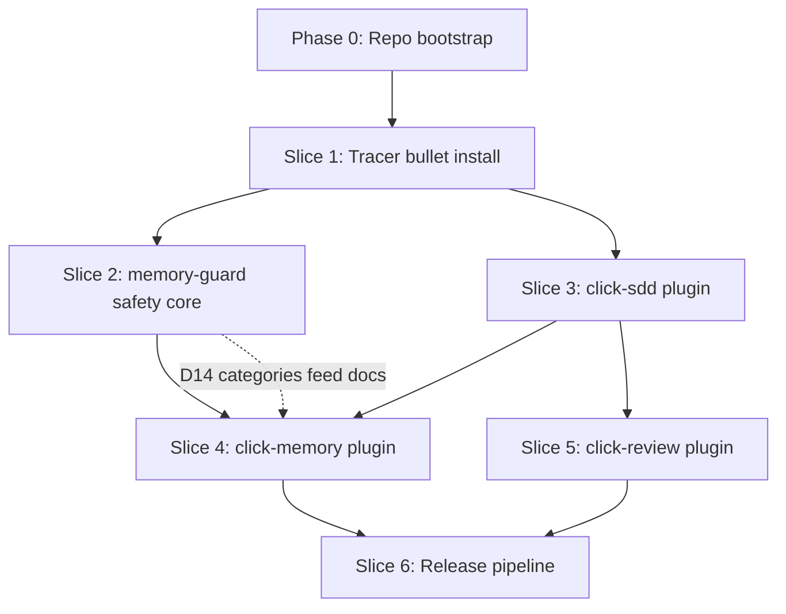

> Status: draft v0.1. Grounded in `00-decisions-and-open-questions.md` (D1–D20).

# click-ai-devkit — Implementation Plan

> Audience: engineers building click-ai-devkit. Turns `tech-spec.md` into an ordered, executable
> build plan. Does not re-litigate decisions (`00-decisions-and-open-questions.md`) or re-derive
> scope (`mvp-scope.md`) — cites them. Every slice's Definition of Done cites `mvp-scope.md` §3
> acceptance criteria and `requirements.md` FR/NFR IDs.

---

## 1. Approach

**Vertical slices / tracer bullet, safety core early, TDD throughout (D13).**

- **Tracer bullet first (Slice 1):** get one minimal end-to-end install/uninstall/doctor loop
  working with a single stub plugin before building out all three plugins and the real guard. This
  proves the CLI's core mechanic (`internal/installer`, `internal/manifest`, `internal/doctor`) —
  the riskiest unknown in `tech-spec.md` §2 — before investing in content.
- **Safety core immediately after (Slice 2):** `memory-guard` is the one component with a hard
  compliance gate (D11: 100% red-team pass before any rollout) and the least tolerance for late
  discovery of design problems (D14's build-time regex authoring, D7's build-time PreToolUse
  mutation-capability caveat). It is built second — right after the tracer bullet proves the
  install mechanic works — not last, so there is maximum runway to iterate on false
  positives/negatives before the canary.
- **Thicken after safety is real (Slices 3–5):** the three plugins' full content (agents, skills,
  policy docs) gets layered on top of a tracer bullet that already installs correctly and a guard
  that already enforces correctly.
- **Release pipeline last (Slice 6):** packaging/distribution only matters once there is something
  real to distribute.
- **Strict TDD (D13):** every Go package in Slices 1–2 and 6 is written test-first — table-driven
  unit tests per `tech-spec.md` §8.1, red-team fixtures per §8.2 written *before* the matching
  engine that must satisfy them. Applies to the CLI's own build, independent of whether
  `click-sdd-code`'s strict-TDD default (D13) is switched on for consumers.

---

## 1.5 Pre-build spikes (D22)

**Two mandatory spikes must complete before coding starts.**

| Spike | Goal | Blocks | Resolution method |
|---|---|---|---|
| **Spike A: Engram packaging mechanism** | Confirm whether Engram ships as a Claude Code plugin (bundle into `~/.claude/plugins/engram/`) or a standalone MCP server (pinned `mcpServers` entry) by inspecting `Gentleman-Programming/engram`'s actual release artifacts and verifying which pattern `click install` must use. | Slice 1 (installer code design) | Read engram's release artifacts directly; pair with Click platform lead if needed |
| **Spike B: Claude Code PreToolUse I/O contract** | Confirm Claude Code PreToolUse hook supports payload mutation (for redaction). If unsupported, `memory-guard` is block-only per D21 (v0.1). If supported, design the redaction I/O contract before Slice 2 coding. | Slice 2 (memory-guard design) | Contact Claude Code SDK lead; document findings in `tech-spec.md` §4 before Slice 2 start |

---

## 2. Phase 0 — Repo bootstrap

| Task | Detail |
|---|---|
| Create private repo | `click-seguros/click-ai-devkit` in the Click Seguros GitHub org (D2) |
| Go module | `go mod init`, module path matching the repo; Go version pinned in `go.mod` |
| `cmd/click/` layout | Scaffold `cmd/click/main.go` + empty `internal/{cli,installer,manifest,doctor,guard,fsutil,version}` packages per `tech-spec.md` §2.5 |
| CI skeleton | GitHub Actions workflow: `go build ./...`, `go vet`, `go test ./...` on push/PR; matrix stub for `windows-latest`/`macos-latest`/`ubuntu-latest` (filled in fully by Slice 6, §8.3) |
| Embedded manifest scaffold | `internal/manifest/manifest.go` + `embed.go` with `go:embed manifest.yaml`; a stub `manifest.yaml` (schema per `tech-spec.md` §2.3) with placeholder versions — **no `.claude-plugin/marketplace.json`** (D16) |
| `plugins/` skeleton | Empty `plugins/click-sdd/`, `plugins/click-memory/`, `plugins/click-review/` directories so Slice 1 has somewhere to point at |
| Repo root files | `README.md` stub, `CLAUDE.md` stub (content filled in Slice 1/3), `SECURITY.md` placeholder (content authored in Slice 2/4) |

**DoD:**
- [ ] Repo exists in the Click org, private, with branch protection on default branch
- [ ] `go build ./...` succeeds from a clean clone
- [ ] CI runs and passes on an empty-but-compiling tree
- [ ] `manifest.yaml` is embedded and readable via `internal/manifest` (unit test asserts parsed struct matches file)
- [ ] No `.claude-plugin/marketplace.json` present anywhere in the skeleton (D16)

---

## 3. Build milestone — ordered slices

### Slice 1 — Tracer bullet install

**Goal:** minimal `click install` that installs one stub plugin end to end, proving the whole
install/uninstall mechanic before content exists.

| | |
|---|---|
| **Depends on** | Phase 0 |
| **Effort** | M |

**Tasks:**
- `internal/cli`: cobra root command + `install`, `doctor`, `uninstall` subcommands; `--dry-run`, `-v`, `--json` (doctor only) flags; exit codes 0/1/2/3 per `tech-spec.md` §2.2
- `internal/installer/plugins.go`: copy one stub plugin directory into `~/.claude/plugins/` (afero-backed, testable)
- `internal/installer/claudemd.go`: write the managed CLAUDE.md block with markers (`tech-spec.md` §2.4); idempotent patch/strip logic, unit-tested for both "absent → append" and "present → replace between markers"
- `internal/installer/mcpconfig.go`: write/merge the Engram MCP entry, version read from the embedded manifest (placeholder pin acceptable at this stage — real pin resolution lands in Slice 6)
- `internal/installer/hooksettings.go`: register a **stub** `memory-guard` PreToolUse hook entry in `~/.claude/settings.json` (matcher `mcp__.*__mem_save`, command `click memory-guard`) — the hook command itself is a no-op stub in this slice (always allow); real decision logic is Slice 2
- `internal/doctor/checks.go`: four checks (plugin present, CLAUDE.md block present, MCP entry present, hook registered) — read-only, never mutates
- Prerequisite check in `install`: verify `~/.claude` exists / `claude` on `PATH`; exit 2 if missing
- `click uninstall`: reverse every step above exactly

**DoD** (mvp-scope.md §3 subset; FR-001–005, FR-009–013, FR-049, FR-050, FR-052; NFR-003, NFR-004, NFR-009, NFR-012):
- [ ] `click install` completes without error on a clean machine and copies the stub plugin, writes the CLAUDE.md block, configures the Engram MCP entry, and registers the (stub) hook
- [ ] `click doctor` reports all four checks healthy after install, and accurately reports unhealthy if any step is reverted manually (NFR-012)
- [ ] `click uninstall` returns the machine to pre-install state (FR-052)
- [ ] Running `click install` → `click doctor` → `click uninstall` → `click install` again succeeds (idempotency smoke, NFR-004)
- [ ] Unit tests cover CLAUDE.md marker patch/strip idempotency, doctor check logic, exit codes

**Key risks:**
- Engram's actual packaging mechanism (bundled plugin vs. standalone MCP server, `tech-spec.md` §5) is unconfirmed — `mcpconfig.go` may need a second code path once verified. Do not block this slice on it; use the MCP-server fallback shape as the placeholder and flag it for Slice 6 re-verification.
- CLAUDE.md marker logic touching a developer's real file is destructive if buggy — afero-backed tests must cover "existing unrelated content preserved" explicitly.

---

### Slice 2 — memory-guard (safety core)

**Goal:** replace the Slice 1 stub hook with the real deterministic PreToolUse guard — the
component with the hardest gate (D11) — plus the red-team harness that must hit 100%.

**v0.1 scope (D21): BLOCK-ONLY.** Redaction is deferred to v0.2 pending Spike B resolution. This keeps regex/redaction off the critical path and maintains fail-closed design: when in doubt, block.

| | |
|---|---|
| **Depends on** | Slice 1 (hook registration plumbing already exists) |
| **Effort** | L |

**Tasks:**
- **Build-time spike (do first, blocking):** confirm against the Claude Code hooks reference current at implementation time whether PreToolUse supports payload **mutation** (needed for "redact"). Document the finding. If unsupported, `redact` degrades to `block-with-reason` everywhere in the engine (`tech-spec.md` §4.1) — this changes the shape of `redact.go` before it's written, so resolve before coding it.
- `internal/guard/patterns/`: author the initial regex/pattern set for the five D14 categories — `pii.yaml`, `policy-numbers.yaml`, `claim-ids.yaml`, `amounts.yaml`, `customer-identifiers.yaml` — per the schema in `tech-spec.md` §4.3 (id, description, pattern, action, severity). Also author `allow-categories.yaml` (permitted technical-knowledge categories per D6).
- `internal/guard/engine.go`: deny-by-default decision engine implementing the flow in `tech-spec.md` §4.2 (allowed category? → forbidden pattern? → allow/block/redact), fail-closed on any internal error/panic (§4.5)
- `internal/guard/redact.go`: redact implementation (or block-degrade per the spike finding above)
- Audit log writer (D20): local JSON, one line per decision — timestamp, decision, matched category, **content hash only** (never raw payload), session id — at `~/.claude/click-memory-guard.log` (rotated)
- Performance: benchmark test asserting <50ms p95 (D19) added latency for a <10KB payload; local in-memory `regexp` only, no network I/O
- `internal/cli/memoryguard.go`: wire `click memory-guard` as the real PreToolUse hook command (replacing the Slice 1 stub), plus `click memory-guard test` exposing the same engine against the **installed** pattern set (including `patterns.local.yaml` override, `tech-spec.md` §4.3) for canary-time tuning without a rebuild
- Red-team fixtures: `testdata/redteam/<category>/*.json`, `{input, expected: block|redact|allow}`, covering every D14 category plus allowed-category positive cases
- `go test ./internal/guard/... -run RedTeam -v`: wired as a **required, blocking** CI check (not advisory)
- `FR-014`/`FR-044`: confirm the hook can be disabled independently in Claude Code settings without a full uninstall (targeted mitigation path)

**DoD** (mvp-scope.md §3: "memory-guard is enforcing... 100% pass rate required"; FR-038–044; NFR-001, NFR-002, NFR-006, NFR-008, NFR-011):
- [ ] Deny-by-default confirmed: unclassified content never passes (FR-040)
- [ ] Every D14 category (PII, policy numbers, claim IDs, amounts, customer identifiers) is blocked or redacted in 100% of red-team fixtures (FR-041, FR-043) — hard gate, no "mostly passes"
- [ ] Fail-closed verified: forcing an engine panic/error results in block, not allow (§4.5)
- [ ] Benchmark shows <50ms p95 added latency (D19, NFR-006)
- [ ] Audit log contains only content hashes, never raw payloads (D20, NFR-008)
- [ ] `click memory-guard test` runs the same fixtures against the installed pattern set and reports pass/fail
- [ ] Guard can be disabled independently of full uninstall (FR-014, FR-044)

**Key risks:**
- PreToolUse mutation-capability caveat (tech-spec §4.1) could invalidate the redact design if resolved late — spike is first task specifically to front-load this risk.
- Initial regex authoring (D14 → concrete patterns) is genuinely new work with no existing reference; false negatives here are the single highest-severity risk in the whole project (data leak). Budget real security-adjacent review time, not just engineering time (see §8 Open items).
- Latency budget dominated by process spawn cost per `tech-spec.md` §4.4 — verify the *hook invocation* path (not just the in-process engine) meets the 50ms budget, since spawn overhead is outside the engine's own benchmark.

---

### Slice 3 — click-sdd plugin

**Goal:** full agents + skills for the SDD flow (explore → prd → design → tasks → code → review),
with `ClickOrchestrator` persona, interactive default, and strict-TDD default wired in.

| | |
|---|---|
| **Depends on** | Slice 1 (plugin install mechanic proven); benefits from Slice 2 existing (curator hands off to a real guard) but not strictly blocked by it |
| **Effort** | L |

**Tasks:**
- `plugins/click-sdd/agents/click-orchestrator.md`: persona per D10 (professional, plain-spoken, replies in Spanish, produces English artifacts, no Gentleman persona carried over); drives phase handoffs, explains each step (FR-033, FR-034)
- `plugins/click-sdd/agents/{click-prd-writer,click-architect,click-reviewer,click-memory-curator}.md`: narrower `tools`/`description` per the orchestrator/specialist split (`references.md` — `agent-teams-lite` pattern, not copied verbatim)
- `plugins/click-sdd/skills/{sdd-explore,sdd-prd,sdd-design,sdd-tasks,sdd-code,sdd-review}/SKILL.md`
- Interactive default (D12): phase handoffs pause for developer confirmation by default; document the override for automatic mode
- Strict-TDD default (D13): `sdd-code/SKILL.md` enforces test-first by default; explicit opt-out flag/marker for spikes/non-production changes
- Language rule enforced in agent instructions: Spanish replies, English artifacts (FR-035, FR-036) — this is the same Persona/Artifact split pattern already established for click-ai-devkit's own build process
- Update Phase-0 CLAUDE.md stub with the real managed-block content from `tech-spec.md` §7.1 (orchestrator activation, persona/language rule, memory-policy pointer, review pointer, footer)
- `click install`/`update` now copy all three real plugin trees (swap out the Slice 1 stub for `click-sdd`)

**DoD** (mvp-scope.md §3: "ClickOrchestrator active... click-sdd-* flow invocable end to end"; FR-022, FR-025–FR-037):
- [ ] Opening Claude Code after install activates `ClickOrchestrator` with no additional developer config (FR-037)
- [ ] Full phase chain manually verified end to end for one worked example (reuse the example in `sdd-workflow.md` §6)
- [ ] Orchestrator replies in Spanish; all produced artifacts (PRD, design, tasks) are in English (FR-035, FR-036)
- [ ] Interactive mode pauses at each phase handoff by default (D12); a documented override exists
- [ ] `sdd-code` enforces strict TDD by default; opt-out path exists and is documented (D13)
- [ ] `click-sdd-review` can loop back to `click-sdd-code` when fixes are required (FR-030)

**Key risks:**
- Rebrand fidelity — must reuse mechanics from `gentle-ai`/`agent-teams-lite` without copying persona/naming (`references.md` explicit constraint); easy to accidentally leak reference branding into agent prose.
- Interactive-vs-automatic UX is genuinely new (D12 has no reference implementation cited) — likely needs a real dry run with a pilot dev before Slice 3 is considered done, not just a manual checklist pass.

---

### Slice 4 — click-memory plugin

**Goal:** the curator's supporting skills plus the human-facing policy docs (D15), authored to
mirror the D14 category structure landed in Slice 2.

| | |
|---|---|
| **Depends on** | Slice 2 (D14 categories must be final before docs are written to mirror them) |
| **Effort** | S |

**Tasks:**
- `plugins/click-memory/skills/{memory-proposal,memory-review}/SKILL.md`
- `plugins/click-memory/docs/allowed-memory.md`: enumerate allowed categories (architecture/design decisions, conventions, patterns, gotchas, bugfixes) per D6
- `plugins/click-memory/docs/forbidden-memory.md`: mirror the five D14 categories exactly (PII, policy numbers, claim IDs, amounts, customer identifiers)
- `plugins/click-memory/docs/memory-policy.md`: document the deny-by-default posture and the two-layer (policy + guard) rationale (`tech-spec.md` §7.1, `architecture.md` §5)
- `plugins/click-memory/docs/engram-setup.md`: how the bundled/pinned Engram instance is configured for a Click developer
- `SECURITY.md` (repo root): author per the outline in `tech-spec.md` §7.2 (scope, data-safety guarantee, enforcement mechanism, false-negative reporting, red-team suite pointer, rollback/kill-switch pointer, pattern-set changelog pointer)
- Note: `click-memory-curator.md` (the agent) already shipped in Slice 3 per the split documented in `tech-spec.md` §3.3 — this slice supplies its supporting skills and docs only, not the agent itself

**DoD** (mvp-scope.md §3: "a mem_save from the curator is retrievable in a later session"; FR-023, FR-031, FR-045–FR-048):
- [ ] `allowed-memory.md`/`forbidden-memory.md` content matches the D14 category set exactly — no drift from Slice 2's implemented patterns
- [ ] `SECURITY.md` covers all seven outline points from `tech-spec.md` §7.2
- [ ] Manual canary-style check: a curator-proposed technical-knowledge entry is saved and retrievable in a later session against a real Engram instance
- [ ] Curator proposes no requirements text, code diffs, or business data (FR-031) — verified via the worked example from Slice 3

**Key risks:**
- Content authoring is mechanical *only if* Slice 2's categories are truly final; any late regex change forces a doc update — treat these as one reviewed unit, not independent PRs.

---

### Slice 5 — click-review plugin

**Goal:** pre-PR/pre-merge review agent and skills, adapted from the `guardian-angel` reference.

| | |
|---|---|
| **Depends on** | Slice 1 (plugin mechanic); can run in parallel with Slice 4 |
| **Effort** | S |

**Tasks:**
- `plugins/click-review/agents/click-pr-reviewer.md`
- `plugins/click-review/skills/{pr-review,pre-merge-checklist}/SKILL.md`
- Wire the loop-back path from `click-sdd-review` (Slice 3) into `click-pr-reviewer` findings

**DoD** (FR-024, FR-030, FR-058):
- [ ] `click-sdd-review` invokes `click-pr-reviewer` and surfaces pass/fail findings to the developer
- [ ] Loop-back to `click-sdd-code` on fix-required findings works end to end
- [ ] No auto-merge/auto-deploy path exists anywhere in the plugin (FR-058 — explicit non-goal, verify by absence)

**Key risks:** low — mostly content authoring; main risk is scope creep toward automation (guard against violating FR-058).

---

### Slice 6 — release pipeline

**Goal:** GoReleaser build, scoop bucket (D18), brew tap (D17 fast-follow), per-release Engram
pinning (D8), versioning, and `click update` moving the pin.

| | |
|---|---|
| **Depends on** | Slices 1–5 (all three plugins must exist to package a real release) |
| **Effort** | M |

**Tasks:**
- **Resolve the Engram packaging mechanism** (tech-spec §5 open verification): confirm whether Engram ships as a Claude Code plugin (bundle into `~/.claude/plugins/engram/`) or a standalone MCP server (pinned `mcpServers` entry) by inspecting `Gentleman-Programming/engram`'s actual release artifacts. Update `internal/installer/mcpconfig.go` (and Slice 1's placeholder) accordingly.
- `ENGRAM_VERSION` file: committed, bumped via its own reviewable PR (optionally bot-proposed, always human-merged) — makes "latest at release-cut time" (D8) an auditable git diff
- GoReleaser config: build `windows/darwin/linux` × `amd64/arm64`; embed `manifest.yaml` via `go:embed` (click version from git tag, `engram.version` from `ENGRAM_VERSION`, real plugin versions); package `plugins/` into the release archive
- Scoop bucket: dedicated `Angel-MercadoCLK/scoop-bucket` repo (D18; personal work account for v0.1, org migration possible later without a design change); GoReleaser `scoop:` block auto-commits the manifest on tag via a scoped deploy token — no manual step
- Brew tap: GoReleaser `brews:` block, same binary, near-zero incremental cost (D17 fast-follow — not a v0.1 launch blocker, but should land before/around team-wide rollout)
- Post-release smoke job: install `click` from the freshly-published bucket on a clean CI runner, run `click doctor --json`, assert all-healthy
- `click update`: verify it re-syncs plugins + moves the Engram pin using only the embedded manifest of the *currently installed* binary — no network resolution beyond what a fresh Engram pin needs (§5)

**DoD** (mvp-scope.md §3: "scoop install... succeeds on a clean Windows machine", "click update re-syncs... without manual file edits"; FR-016–021, FR-051; NFR-003–005):
- [ ] `scoop bucket add click https://github.com/Angel-MercadoCLK/scoop-bucket` then `scoop install click` succeeds on a clean Windows machine (integration test, windows-latest runner; D18)
- [ ] Tagging a release produces binaries for all three OSes, a published GitHub Release, and an auto-committed scoop bucket update
- [ ] `click update` moves the Engram pin correctly when the underlying `click` binary is upgraded first (two-step motion per `tech-spec.md` §2.1), and is idempotent on a second run (NFR-004)
- [ ] Post-release smoke job passes on a clean runner
- [ ] Brew tap builds successfully (even if not yet promoted as a primary channel — FR-018 is Should, not Must)

**Key risks:**
- Engram packaging mechanism must be resolved here at the latest — it was deferred as a placeholder since Slice 1; if it turns out to require a materially different install code path, this slice's estimate could slip.
- Scoped deploy token to the scoop bucket repo is a real secret with write access to a separate repo — handle via CI secrets, not committed anywhere.

---

## 4. Dependency graph



ASCII equivalent:

```
Phase 0
  └─▶ Slice 1 (tracer bullet)
        ├─▶ Slice 2 (memory-guard) ─┐
        └─▶ Slice 3 (click-sdd) ────┼─▶ Slice 4 (click-memory) ─┐
                                     └─▶ Slice 5 (click-review) ─┴─▶ Slice 6 (release pipeline)
```

Slices 4 and 5 can run in parallel once Slice 3 lands. Slice 4 additionally needs Slice 2's D14
pattern categories finalized before its policy docs are authored.

---

## 5. Canary phase & team-wide rollout

Concretizes `adoption-plan.md` into an executable checklist.

### 5.1 Pre-canary checklist

- [ ] Slices 1–6 all pass their own DoD
- [ ] `mvp-scope.md` §3 acceptance criteria pass in full on a clean machine (integration-tested, §8.3 below)
- [ ] Red-team guard suite is 100% green (Slice 2 DoD) — re-verify immediately before canary start, not just at the PR that landed it
- [ ] `SECURITY.md`, `allowed-memory.md`, `forbidden-memory.md` are final and reviewed by a security-adjacent stakeholder (Slice 4 DoD)
- [ ] Canary owner and 2–3 canary devs identified (`adoption-plan.md` §3)
- [ ] Self-report mini-log template ready (`adoption-plan.md` §5) — shared spreadsheet or per-dev markdown log
- [ ] `memory-guard` deployable in **observe+block mode** for the canary window (confirm the mode toggle exists; if not, add it as a Slice 2 follow-up task before canary start)

### 5.2 Canary run (3–5 days, 2–3 devs — D11)

1. Day 0: install for all canary devs; confirm `click doctor` green for each
2. Days 1–5: normal AI-assisted work via `ClickOrchestrator`; self-report log filled after each session
3. During the window: canary owner + supporting engineer run deliberate red-team attempts against the live install (not just CI fixtures) — real developer workflows attempting to save PII/policy/claims data

### 5.3 Go/no-go gate (hard gate — `adoption-plan.md` §4)

Proceed to team-wide rollout **only if all hold**:

- [ ] Red-team PII test: 100% blocked/redacted, no exceptions
- [ ] `click doctor` healthy for all canary participants throughout the window
- [ ] No canary participant reports the guard blocking legitimate technical-knowledge saves at a rate that makes the tool unusable (qualitative — flag to leadership if it comes up)
- [ ] Self-report logs exist for the window

If the red-team test fails at any point: fix the pattern set (`patterns.local.yaml` for fast iteration, folded back into the next release per `tech-spec.md` §4.3), re-run, repeat until 100%. **Do not relax to "mostly passes."**

### 5.4 Team-wide rollout (same sprint as go/no-go)

1. Canary owner (or successor) installs for the rest of the team
2. Support plan active: `click doctor` is the first troubleshooting step for any install issue (`adoption-plan.md` §7)
3. Self-report continues; false-positive/negative triage loop continues (pattern set treated as iterative, not one-time)
4. Rollback path stays available indefinitely: per-developer `click uninstall`, or targeted guard-only disable (no server-side kill switch in v0.1 — `adoption-plan.md` §8)

---

## 6. Testing & CI per slice

| Slice | Unit tests | Red-team / fixture tests | Integration tests |
|---|---|---|---|
| Phase 0 | Manifest parse round-trip | — | CI compiles + runs on push |
| Slice 1 | `afero`-backed install/uninstall reversibility, CLAUDE.md marker idempotency, doctor check logic, exit codes (`tech-spec.md` §8.1) | — | Clean-machine install→doctor→uninstall→install cycle (§8.3, local dev machine acceptable pre-Slice-6) |
| Slice 2 | Engine decision-flow unit tests (allow/block/redact per category), fail-closed-on-panic test, latency benchmark | **Full red-team suite, required CI gate, 100% green** (`go test ./internal/guard/... -run RedTeam -v`) — blocks merge, not advisory (§8.2) | `click memory-guard test` run against installed patterns |
| Slice 3 | — (markdown content; no Go tests) | — | Manual end-to-end phase-chain walkthrough using the worked example (`sdd-workflow.md` §6) |
| Slice 4 | — | Re-run red-team suite if any doc change implies a pattern change | Manual: curator entry saved and retrieved from a real Engram instance in a later session |
| Slice 5 | — | — | Manual: review loop-back from `click-sdd-review` to `click-sdd-code` |
| Slice 6 | GoReleaser config lint, manifest generation test | Red-team suite re-run as a required pre-tag CI check (§8.2) | **GitHub Actions matrix**: `windows-latest` (primary, scoop), `macos-latest`, `ubuntu-latest` (NFR-005) — fresh runner → install → `click doctor --json` all-healthy → uninstall → assert full reversal → re-install → assert idempotent success (§8.3) |

Acceptance-criteria-to-verification mapping is fully enumerated in `tech-spec.md` §8.4 — this table
adds *which slice* each check first becomes exercisable in, not a new mapping.

---

## 7. Risks & sequencing rationale

| Why this order | Rationale |
|---|---|
| Tracer bullet before content | The install/uninstall/doctor mechanic (afero, marker patching, manifest embedding) is the riskiest *mechanical* unknown — proving it with one stub plugin is cheaper than discovering a design flaw after three plugins' worth of content exists. |
| Safety core (Slice 2) before plugin content (Slices 3–5) | D11's hard gate (100% red-team) is the single highest-severity requirement in the project (data leak risk for a regulated insurer). Building it second — not last — maximizes iteration time on the hardest-to-get-right component (regex authoring, fail-closed behavior, the PreToolUse mutation caveat) before the canary clock starts. |
| click-memory (Slice 4) after memory-guard (Slice 2), not before | `allowed-memory.md`/`forbidden-memory.md` must mirror the *actual implemented* D14 categories (D15) — authoring them first risks drift from what the engine actually enforces. |
| Release pipeline (Slice 6) last | Packaging has nothing real to package until all three plugins exist; also the point where the deferred Engram-packaging-mechanism question must finally be resolved (tech-spec §5) — better resolved once, late, with full context, than guessed at twice. |
| Strict TDD (D13) applied to the CLI's own build | AI/human-written Go code without test-first discipline is exactly the higher-defect-risk path D13's rationale describes — the CLI enforces on its own consumers (`click-sdd-code`) what it should also practice on itself. |

**Standing risks carried across slices:**

| Risk | Mitigation | Where addressed |
|---|---|---|
| Engram packaging mechanism unconfirmed | Placeholder path in Slice 1, resolved definitively in Slice 6 before release | Slice 1, Slice 6 |
| PreToolUse mutation support unconfirmed | Spike as the first task of Slice 2, before `redact.go` is written; fail-closed degrade-to-block if unsupported | Slice 2 |
| D14 regex false negatives (data leak) | Security-adjacent review + 100% red-team gate as a blocking CI check and again as the canary go/no-go gate | Slice 2, §5.3 |
| Go maintenance burden (D5 trade-off) | Accepted deliberately; CLI scope kept thin (install/update/doctor/uninstall only, NFR-007) | All Go slices |
| Canary too small/short to catch edge cases | Deliberate trade-off (D11); go/no-go can extend or repeat the canary | §5.3 |

---

## 8. Open / blocking items to resolve during build

Carried forward from `00-decisions-and-open-questions.md` §3 and `tech-spec.md` §9 — genuinely
open, not resolved by this plan. Each is pinned to the slice where it must be resolved.

| Item | Must resolve by | Notes |
|---|---|---|
| Author the concrete PII/insurance regex for each D14 category | Slice 2 | Assign to a security-adjacent engineer + canary owner; every rule validated against the red-team harness before the canary starts, not after (tech-spec §9 OI-3) |
| Confirm whether Claude Code PreToolUse supports payload mutation ("redact") | Slice 2, first task | If unsupported, redact degrades to block-with-reason everywhere — this is a design input, not a post-hoc patch |
| Confirm Engram's actual packaging mechanism (bundled plugin vs. standalone MCP server) | Slice 1 (placeholder), Slice 6 (final) | Requires inspecting `Gentleman-Programming/engram`'s release artifacts directly — cannot be resolved from this repo's docs alone (tech-spec §5) |
| ~~**Propagate D16 into `architecture.md` §4 and `mvp-scope.md` §2**~~ DONE | — | Marketplace.json removed from repo structure; D16 applied throughout planning docs |
| ~~**Stale headers (D1–D11 → D1–D20)**~~ DONE | — | All planning docs updated to reflect D1–D20 scope |
| Author `allowed-memory.md`, `forbidden-memory.md`, `SECURITY.md` content | Slice 4 | Mechanical once Slice 2's categories are final; needs canary-owner + security-stakeholder sign-off before canary (tech-spec §9 OI-4) |
| `memory-guard` observe+block toggle for the canary | Confirm exists (or add) before §5.1 pre-canary checklist | `adoption-plan.md` assumes this mode exists; not explicitly scoped as a Slice 2 task above — verify during Slice 2 and add if missing |

No genuine contradiction was found between `00-decisions-and-open-questions.md`, `tech-spec.md`,
`requirements.md`, `mvp-scope.md`, and `adoption-plan.md` — the discrepancies above are documented
staleness/propagation gaps (D16 not yet reflected in two docs; `tech-spec.md`'s header not yet
bumped), not conflicting decisions.
