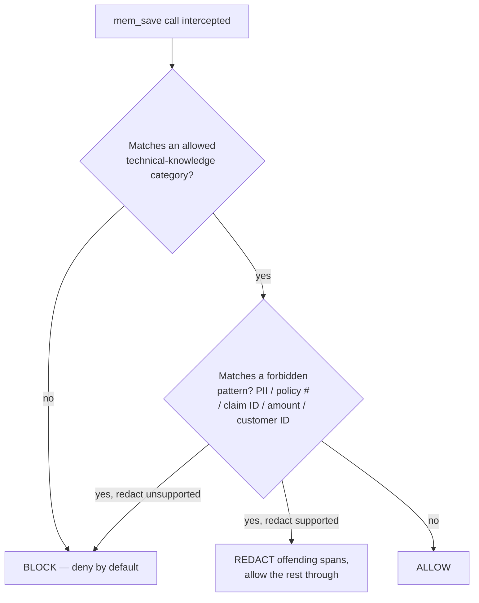

> Status: draft v0.1. Grounded in `00-decisions-and-open-questions.md` (D1–D20).

# click-ai-devkit — Technical Specification

> Audience: engineers building click-ai-devkit itself. This document specifies *how* the locked
> decisions (D1–D20) and requirements (`requirements.md` FR-001–FR-060, NFR-001–NFR-012) get built.
> It does not re-litigate product framing (`prd.md`, `vision.md`) or re-derive scope
> (`mvp-scope.md`) — it assumes them and designs against them.
>
> Where a topic is a genuinely open item (per `00-decisions-and-open-questions.md` §3 and the
> open-item sections of the other docs), this spec makes a concrete **proposed resolution**,
> clearly marked **PROPOSAL — needs sign-off**. Proposals are not decisions; do not treat them as
> locked. They are collected in §9.

---

## 1. Overview & design principles

`click-ai-devkit` has exactly one piece of compiled software — the Go CLI (`click`) — and
everything else is markdown (agents, skills, docs) plus a bundled, pinned Engram instance. That
split is deliberate and drives every design decision in this spec.

| Principle | What it means here | Requirement(s) |
|---|---|---|
| **Thin CLI, not the orchestration brain** | `click` only installs/updates/verifies/removes files and config. It never calls Claude, never runs an SDD phase, never touches git. | FR-015, NFR-007 |
| **Markdown-first SDD flow** | The `click-sdd-*` flow lives entirely in agent/skill markdown executed by Claude Code — reused/rebranded, not rewritten in Go. | D9, NFR-007 |
| **Deterministic safety, independent of the model** | The data-safety guarantee (no PII/policy/claims/amounts/customer-ID ever reaches Engram) must hold even if the model ignores the policy docs. Enforcement is a PreToolUse hook, not a prompt. | D6, D7, NFR-001, NFR-002 |
| **Reproducibility** | The same click-ai-devkit release produces the same installed plugin set and the same pinned Engram version on any machine; `click update` is idempotent. | D8, NFR-003, NFR-004 |
| **Two-layer memory model** | Human-facing policy docs guide *intent*; the deterministic guard enforces *outcome*. Neither layer alone is sufficient. | D6, D7 |
| **Gradual, gated adoption** | Nothing here assumes team-wide trust on day one — the canary and its 100% red-team gate are load-bearing, not ceremonial. | D11 |

This spec covers the CLI (§2), the three plugins (§3), the memory-guard hook (§4), Engram
integration (§5), distribution/release (§6), CLAUDE.md/SECURITY.md content (§7), testing (§8), the
consolidated open-item proposals (§9), and traceability (§10).

---

## 2. Go CLI (`click`) design

### 2.1 Commands

| Command | Responsibility | Requirement(s) |
|---|---|---|
| `click install` | First-time setup: copy plugins, write CLAUDE.md block, configure Engram, register the guard hook. | FR-001–FR-005 |
| `click update` | Re-sync everything to the version pinned by the **currently installed `click` binary** — never a floating "latest". | FR-006–FR-008, FR-051 |
| `click doctor` | Read-only health check of every install step; never mutates state. | FR-009, FR-010, NFR-012 |
| `click uninstall` | Reverse `install` exactly: remove plugins, deregister the hook, strip the CLAUDE.md block. | FR-011–FR-013, FR-052, FR-053 |
| `click memory-guard` | Not developer-facing — invoked *by Claude Code itself* as the PreToolUse hook command (see §4). Ships in the same binary so there is nothing extra to install. | FR-038, FR-039, FR-042 |

#### `click install`

1. **Prerequisite check** — verify Claude Code is already present (per the explicit assumption in
   `requirements.md` §5: click-ai-devkit installs *into* an existing Claude Code setup, it does not
   install Claude Code). Check: `~/.claude` directory exists, and/or `claude` resolves on `PATH`.
   Missing → exit code 2 with a clear message; do not attempt partial install.
2. Copy `plugins/click-sdd/`, `plugins/click-memory/`, `plugins/click-review/` into
   `~/.claude/plugins/` (FR-001).
3. Write the managed CLAUDE.md block (see §2.4, §7.1) (FR-002).
4. Write/merge the Engram MCP entry at the version pinned by this release's embedded manifest
   (§2.3, §5) (FR-003).
5. Register the `memory-guard` PreToolUse hook in Claude Code's hook settings (§4.1) (FR-004).
6. Run the same checks `click doctor` runs, internally, and fail loudly if any didn't land — never
   report success on a partial install (FR-005).

#### `click update`

Re-runs steps 2–5 above against the **embedded manifest of the currently installed `click`
binary**. This means moving the Engram pin (D8) is a two-step motion:

```
scoop update click   (or: brew upgrade click)   → fetches new binary + new embedded manifest
click update                                     → applies that manifest to ~/.claude
```

`click update` never resolves anything over the network itself beyond what step 4 needs (see §5)
— the plugin versions and the Engram pin are already known, embedded in the binary at build time
(§2.3). This is what makes FR-006–FR-008 and NFR-004 (idempotency) straightforward: running
`update` twice against the same binary is a no-op diff on the second run.

#### `click doctor`

Read-only. Reports, per check, pass/fail — never guesses "probably fine":

| Check | Pass condition |
|---|---|
| Plugins present | `~/.claude/plugins/click-{sdd,memory,review}/` exist and match the installed manifest's file list/checksums |
| CLAUDE.md block | Managed markers present and content matches the installed manifest's expected block |
| Engram MCP entry | Present, version matches the installed manifest's pinned Engram version |
| Guard hook registered | PreToolUse hook entry present in Claude Code hook settings, pointing at `click memory-guard` |

Supports `--json` for machine-readable output (used by the canary owner and by the integration test
suite, §8.3) and a non-zero exit code if any check fails, so it is scriptable in CI (FR-009, FR-010,
NFR-012).

#### `click uninstall`

Reverses `install` step by step: remove the three plugin directories, deregister the hook entry,
delete the managed CLAUDE.md block (markers included). Leaves the machine equivalent to before
`install` ever ran (FR-011–FR-013, FR-052). This is also the documented immediate-mitigation path
if the guard misbehaves post-rollout (FR-053, adoption-plan.md §8) — it must be trustworthy and
boring, not a best-effort cleanup.

### 2.2 Flags & exit codes

| Flag | Applies to | Behavior |
|---|---|---|
| `--dry-run` | install, update, uninstall | Prints the planned filesystem/config diff, applies nothing |
| `-v` / `--verbose` | all | Extra step-by-step logging |
| `--json` | doctor | Machine-readable report |

| Exit code | Meaning |
|---|---|
| 0 | Success |
| 1 | Generic failure |
| 2 | Prerequisite missing (e.g., Claude Code not found) |
| 3 | Partial/inconsistent state detected — run `click doctor` |

### 2.3 Manifest / config format — and reconciling `marketplace.json`

**Historical note:** D16 originally proposed dropping `.claude-plugin/marketplace.json` from the
repo skeleton for v0.1. `click` uses its own purpose-built manifest instead, because the two
formats serve different install *paths* (Claude Code's native `/plugin marketplace add` flow vs.
the Go CLI's controlled install), and running both risks two divergent, non-reproducible ways to
end up with click-ai-devkit installed — directly in tension with NFR-003.

Proposed manifest, embedded into the binary at build time via `go:embed` (so `click doctor`/
`click update` need zero network calls to know what "this release" means):

```yaml
# manifest.yaml — generated by the release pipeline, one per click-ai-devkit release (§6)
schema_version: 1
click_version: "0.1.0"
engram:
  version: "1.15.3"                              # pinned per D8 at release-cut time
  source: "github.com/Gentleman-Programming/engram"
plugins:
  click-sdd:    { version: "0.1.0", path: "plugins/click-sdd" }
  click-memory: { version: "0.1.0", path: "plugins/click-memory" }
  click-review: { version: "0.1.0", path: "plugins/click-review" }
min_claude_code_version: "1.x"
```

The plugin *content* itself ships inside the same release archive as the binary (not fetched
separately at install time) — `click install`/`update` copy from the embedded/bundled archive
contents into `~/.claude/plugins/`, so install works offline except for whatever Engram's own
runtime dependency resolution needs (§5).

### 2.4 CLAUDE.md safe editing (managed block)

```
<!-- click-ai-devkit:managed:begin — do not edit between markers; use `click update` / `click uninstall` -->
...Click rules content (§7.1)...
<!-- click-ai-devkit:managed:end -->
```

`install`/`update` find the markers (if present) and replace only the content between them —
idempotent by construction. If absent, the block is appended (file created if needed). `uninstall`
deletes everything between and including the markers, leaving the rest of a developer's own
CLAUDE.md untouched (FR-013, FR-050, FR-052).

### 2.5 Project layout

```
cmd/click/
  main.go                    # entrypoint, wires the cobra root command

internal/
  cli/                       # cobra command definitions
    root.go install.go update.go doctor.go uninstall.go memoryguard.go
  installer/                 # plugin sync, CLAUDE.md patch, MCP config writer, hook registration
    plugins.go claudemd.go mcpconfig.go hooksettings.go
  manifest/                  # embedded release manifest (§2.3)
    manifest.go embed.go     # go:embed manifest.yaml
  doctor/                    # health checks, shared by `doctor` and post-install verification
    checks.go
  guard/                     # memory-guard decision engine — shared by the hook and its tests (§4)
    patterns/                # embedded pattern files by category (yaml)
    engine.go redact.go
  fsutil/                    # testable filesystem helpers (afero-backed, §8.1)
  version/                   # build-time version/ldflags plumbing
```

**Key libraries (proposed):**

| Library | Why |
|---|---|
| `spf13/cobra` | CLI framework; matches the gentle-ai reference convention (references.md) |
| `spf13/afero` | Testable filesystem abstraction — install/uninstall reversibility is unit-testable without touching a real `~/.claude` (§8.1) |
| `gopkg.in/yaml.v3` | Manifest + pattern-file parsing |
| `stretchr/testify` | Unit test assertions |

---

## 3. Plugins

Three markdown plugins, per D9 and `architecture.md` §4. Structure is a rebrand/adaptation of the
`Gentleman-Skills` `SKILL.md` convention and gentle-ai's agent/skill split (`references.md`) — not
a rewrite.

### 3.1 Agent frontmatter

```markdown
---
name: click-orchestrator
description: Default SDD orchestrator for Click Seguros sessions. Drives the click-sdd-* flow,
  explains each phase handoff in plain Spanish, delegates artifact writing to specialist agents.
  Use proactively for any feature work.
tools: Read, Write, Edit, Glob, Grep, Bash, Agent
model: sonnet
---

<system prompt / instructions body — persona per D10, flow per sdd-workflow.md>
```

Same shape for `click-prd-writer.md`, `click-architect.md`, `click-reviewer.md`,
`click-memory-curator.md` (in `plugins/click-sdd/agents/`, FR-022) and `click-pr-reviewer.md` (in
`plugins/click-review/agents/`, FR-024) — each narrower in `tools`/`description` than the
orchestrator, per the orchestrator/specialist split (`agent-teams-lite` reference).

### 3.2 `SKILL.md` format

```markdown
---
name: sdd-explore
description: Investigate the existing codebase and compare candidate approaches before committing
  to a plan, for a Click Seguros feature request. Trigger at the start of any new change.
---

## Workflow
1. ...
```

### 3.3 Skill/agent → SDD phase mapping

| Phase | Skill | Driving agent | Plugin |
|---|---|---|---|
| click-sdd-explore | `sdd-explore/SKILL.md` | `click-orchestrator` | `click-sdd` |
| click-sdd-prd | `sdd-prd/SKILL.md` | `click-prd-writer` | `click-sdd` |
| click-sdd-design | `sdd-design/SKILL.md` | `click-architect` | `click-sdd` |
| click-sdd-tasks | `sdd-tasks/SKILL.md` | `click-architect` | `click-sdd` |
| click-sdd-code | `sdd-code/SKILL.md` | orchestrator-driven | `click-sdd` |
| click-sdd-review | `sdd-review/SKILL.md` | `click-reviewer` | `click-sdd` |
| memory curation | `memory-proposal/SKILL.md`, `memory-review/SKILL.md` | `click-memory-curator` | `click-memory` |
| PR/pre-merge check | `pr-review/SKILL.md`, `pre-merge-checklist/SKILL.md` | `click-pr-reviewer` | `click-review` |

`click-memory-curator.md` (the agent) lives in `click-sdd/agents/` while its supporting skills live
in `click-memory/skills/` — this split is intentional (FR-022/FR-023), not an inconsistency: the
curator is a phase in the SDD flow, but the mechanics of *what's allowed to be saved* are owned by
the memory plugin, alongside the guard.

---

## 4. memory-guard PreToolUse hook

This is the core safety component (D7) and the hardest gate before rollout (D11, FR-043). Two
layers exist by design (`architecture.md` §5): the markdown policy docs guide the model's *intent*;
this hook is the *control*.

### 4.1 How the hook is wired

Claude Code PreToolUse hooks are configured in `~/.claude/settings.json` under `hooks.PreToolUse`:
an array of `{ matcher, hooks: [{ type: "command", command: "..." }] }` entries. The harness
invokes the matched command **synchronously, before** the tool call executes, and the command's
response gates whether the call proceeds.

`click install` registers:

```json
{
  "hooks": {
    "PreToolUse": [
      {
        "matcher": "mcp__.*__mem_save",
        "hooks": [{ "type": "command", "command": "click memory-guard" }]
      }
    ]
  }
}
```

The matcher targets Engram's exposed `mem_save` tool specifically (FR-038 — "every `mem_save`
call"), not all tool use. Running `click memory-guard` as a subcommand of the same static binary
(rather than a separate compiled hook) keeps distribution to one artifact, consistent with D5's
"single static binary, no runtime" ethos.

**Implementation note — verify at build time:** the exact PreToolUse I/O contract (stdin JSON
shape, and whether the platform lets a hook *mutate* the tool input for a "redact" outcome, versus
only allow/deny) must be confirmed against the Claude Code hooks reference current at
implementation time — hook capabilities have moved between releases. If payload mutation is not
available, **redact must degrade to block-with-reason** rather than silently attempting a rewrite
that isn't supported. This is the safe direction: block is a strict subset of what redact
guarantees (nothing sensitive reaches Engram either way), so degrading never violates NFR-001.

### 4.2 Decision flow



This is the deny-by-default / allowlist posture from D6 made literal: content must first match an
*allowed* category before the forbidden-pattern scan even matters — there is no path where
unclassified content passes through by default (FR-040).

### 4.3 Where the pattern set lives (structure proposed; content is an open item — §9 OI-3)

```
plugins/click-memory/guard/
  allow-categories.yaml       # permitted technical-knowledge categories
  patterns/
    pii.yaml
    policy-numbers.yaml
    claim-ids.yaml
    amounts.yaml
    customer-identifiers.yaml
    _schema.md                 # documents the schema below
  testdata/redteam/<category>/*.json   # red-team fixtures (§4.5)
```

Proposed per-category schema:

```yaml
category: policy-numbers
version: 1
action: block            # block | redact — default action, overridable per rule
rules:
  - id: policy-numbers/001
    description: "<human-readable description — no real example data in the repo>"
    pattern: "<regex — authoring is a separate task, see §9 OI-3>"
    action: block
    severity: high
```

Patterns are **embedded** in the binary by default (versioned with the release, same reproducibility
guarantee as the manifest). For the hardening canary's iterative false-positive/false-negative
triage (`adoption-plan.md` §7), propose an **optional local override file**,
`~/.claude/plugins/click-memory/guard/patterns.local.yaml`, merged on top of the embedded set at
runtime — lets the canary owner tune quickly without a full release cycle, with the expectation
that stabilized changes get folded back into the next release's embedded set.

### 4.4 Performance (NFR-006 — no numeric target locked; proposed here, §9 OI-8)

Pattern matching itself is local, in-memory Go `regexp` evaluation against embedded rules — no
network I/O, no external calls. **Proposed budget: <50ms p95** added latency for a typical
`mem_save` payload (<10KB), dominated by process spawn (a static binary starts in low
single-digit ms) rather than matching time.

### 4.5 Fail-closed behavior

If the hook process errors, panics, or produces an unexpected exit code, the call **must be
treated as blocked** — consistent with D6's deny-by-default posture. A guard that fails open on
its own bug would silently undermine NFR-001/NFR-002; there is no ambiguity to leave here.

### 4.6 Red-team test harness (must hit 100% before rollout — D11, FR-043)

- Fixtures: one JSON file per test case under `testdata/redteam/<category>/`, each
  `{ "input": "...", "expected": "block" | "redact" | "allow" }`.
- `go test ./internal/guard/... -run RedTeam -v` iterates every fixture and asserts the engine's
  decision matches. This is a required, blocking CI check — not advisory (§8.2).
- `click memory-guard test` exposes the same harness against the **installed** pattern set
  (including any local override, §4.3), so the canary owner can re-validate after tuning without
  rebuilding — directly supports the adoption-plan.md §7 iteration loop and the go/no-go gate
  (`adoption-plan.md` §4).

---

## 5. Engram integration

Per D1 ("batteries-included") and D8 ("bundled at latest, pinned per click release").

**Proposed primary mechanism:** Engram ships as a Claude Code *plugin* (matching how it actually
surfaces at runtime — its MCP tools are namespaced as a plugin, e.g. `plugin:engram:engram` in this
very environment). `click install` bundles a pinned Engram plugin build inside the release archive
(alongside Click's own three plugins) and copies it into `~/.claude/plugins/engram/`, recording its
version in the embedded manifest (§2.3) and validating it via `click doctor`.

**Fallback mechanism (if Engram is instead distributed as a standalone MCP server binary/npm
package):** `click install` writes/merges an `mcpServers` entry in Claude Code's MCP config,
pinned to the exact version in the manifest (e.g., `npx -y @gentleman-programming/engram@1.15.3`)
rather than an unpinned `@latest`.

> This spec cannot confirm which of the two matches Engram's actual released packaging without
> inspecting `Gentleman-Programming/engram`'s own release artifacts directly — flagged here as a
> concrete implementation-time verification step, not left ambiguous by omission. Either mechanism
> satisfies FR-003, FR-019–FR-021, FR-051, and NFR-003/NFR-004 identically from the CLI's
> perspective: install/update apply exactly the manifest's pinned version, never a floating one.

**Moving the pin (D8 — "updating click updates Engram"):** the pin is a property of the *embedded
manifest*, not resolved independently at install/update time. Moving it is therefore always a
two-step motion (see §2.1): update the `click` binary itself (which carries a new manifest with a
new `engram.version`), then run `click update` to apply it. This keeps FR-007 ("no floating
latest") true without needing `click update` to make any network decision about *which* Engram
version is correct.

---

## 6. Distribution & release

### 6.1 Scoop bucket manifest (primary channel — D3, D5, D23, FR-016)

Published into a `bucket/` folder inside this same `click-ai-devkit` repo (D23) — not a separate
`scoop-bucket` repo. No dedicated deploy token is required; GoReleaser's `scoop:` block commits the
manifest using the default `GITHUB_TOKEN` from GitHub Actions, since it writes to the same repo.

```json
{
  "version": "0.1.0",
  "description": "click-ai-devkit — Click Seguros' installable Claude Code system",
  "homepage": "https://github.com/Angel-MercadoCLK/click-ai-devkit",
  "license": "Proprietary",
  "architecture": {
    "64bit": {
      "url": "https://github.com/Angel-MercadoCLK/click-ai-devkit/releases/download/v0.1.0/click_0.1.0_windows_amd64.zip",
      "hash": "sha256:<checksum>"
    }
  },
  "bin": "click.exe",
  "checkver": "github",
  "autoupdate": {
    "architecture": {
      "64bit": {
        "url": "https://github.com/Angel-MercadoCLK/click-ai-devkit/releases/download/v$version/click_$version_windows_amd64.zip"
      }
    }
  }
}
```

### 6.2 brew tap (optional/deferred for v0.1 — FR-018, NFR-005; timing addressed in §9 OI-6)

Same Go binary, no extra maintenance surface once the release pipeline exists — GoReleaser can
emit a Homebrew formula (`brews:` config) alongside the scoop manifest for near-zero incremental
cost. Not required for v0.1 launch.

### 6.3 CI release pipeline (GoReleaser)

1. Tag push `vX.Y.Z` triggers the release workflow.
2. **Engram pin resolution — proposed as a deliberate, reviewable step, not a silent build-time
   query:** a committed `ENGRAM_VERSION` file in the repo is bumped via its own PR (optionally
   opened by a scheduled bot proposing the newest Engram release, but always merged by a human).
   This keeps "latest at release-cut time" (D8) auditable as a normal git diff, rather than a
   float that changes what a release *means* after the fact.
3. `goreleaser release` builds `windows/darwin/linux` × `amd64/arm64` binaries, embeds
   `manifest.yaml` (click version from the git tag, `engram.version` from `ENGRAM_VERSION`, plugin
   versions) via `go:embed`, packages `plugins/` into each release archive, generates checksums,
   publishes to GitHub Releases.
4. GoReleaser's `scoop:` block auto-commits the updated manifest to this repo's `bucket/` folder (D23; §9 OI-7).
5. (Once prioritized) GoReleaser's `brews:` block auto-commits to a Homebrew tap repo.
6. Post-release smoke job: install from the freshly-published bucket on a clean CI runner, run
   `click doctor --json`, assert all-healthy (ties to §8.3).

### 6.4 Versioning scheme

click-ai-devkit uses SemVer (`vMAJOR.MINOR.PATCH`), independent of Engram's own version number.
Engram's pin is tracked via `ENGRAM_VERSION`/the embedded manifest, not click's own version — so a
click patch release doesn't imply an Engram bump, and an Engram bump always produces its own new
click release (keeping the D8 "same release ⇒ same Engram version" pairing exact, NFR-003).

---

## 7. CLAUDE.md rules & SECURITY.md

### 7.1 CLAUDE.md content installed by `click install` (managed block, §2.4)

- **Orchestrator activation** — use `ClickOrchestrator` by default for this environment; delegate
  SDD phases to the `click-sdd-*` skills/agents (FR-002, FR-049).
- **Persona/language rule (D10)** — reply to the developer in Spanish; produce all artifacts
  (PRD, design, tasks, memory entries) in English; plain-spoken, no unexplained jargon, no
  regional slang (FR-034–FR-036).
- **Memory-policy pointer** — reference `plugins/click-memory/docs/memory-policy.md`,
  `allowed-memory.md`, `forbidden-memory.md` before any `mem_save`; note explicitly that
  `memory-guard` enforces this regardless of what the model attempts (FR-045).
- **Review pointer** — reference `click-review`'s pre-merge checklist.
- **Footer** — "this block is managed by `click`; edit via `click update`, remove via
  `click uninstall`."

### 7.2 `SECURITY.md` purpose & outline — **PROPOSAL, needs sign-off** (see §9 OI-4)

**Purpose:** the single place documenting click-ai-devkit's data-safety guarantee and how to report
a suspected gap — an internal-tool adaptation of the standard OSS `SECURITY.md` convention.

**Proposed outline:**

1. **Scope** — covers the memory-guard's two-layer data-safety model only; not a general
   application-security policy.
2. **Data-safety guarantee** — deny-by-default/allowlist posture; forbidden categories mirrored
   from `forbidden-memory.md`.
3. **How enforcement works** — deterministic PreToolUse hook, fail-closed behavior (§4.5),
   independent of model compliance (NFR-002).
4. **Reporting a suspected false negative** — who to contact (canary owner / supporting engineer,
   per `adoption-plan.md` §3 roles) and how, **without re-pasting the sensitive data itself** into
   the report.
5. **Red-team test suite** — how it's run (§4.6), the 100%-pass gate, how to add a new case.
6. **Rollback / kill-switch** — pointer to `adoption-plan.md` §8 (disable the hook alone, or full
   `click uninstall`).
7. **Pattern-set changelog** — the pattern set is expected to evolve iteratively
   (`adoption-plan.md` §7); this section points at where that history lives.

---

## 8. Testing strategy

### 8.1 Unit tests (CLI)

Table-driven Go tests per `internal/` package, filesystem calls mediated through `afero` so
install/update/uninstall reversibility (FR-052) is testable without touching a real `~/.claude`.
Coverage focus: manifest parsing, CLAUDE.md marker patch/strip idempotency (NFR-004), doctor check
logic, exit-code correctness.

### 8.2 Red-team guard test suite (blocking gate — D11, FR-043)

`go test ./internal/guard/... -run RedTeam -v` against the fixtures in §4.6 — must be **100%**
green, enforced as a required CI check before any release tag and again, explicitly, as the go/no-go
gate criterion during the hardening canary (`adoption-plan.md` §4). A single failing case blocks
the merge/release; there is no "mostly passes" threshold (per the hard-gate language in
`adoption-plan.md` §1).

### 8.3 Integration tests (install/doctor/uninstall on a clean machine)

GitHub Actions matrix across `windows-latest` (primary — scoop, D3), `macos-latest`, `ubuntu-latest`
(binary buildability per NFR-005):

1. Fresh runner → install `click` from the just-built release artifact.
2. `click install` → assert exit 0.
3. `click doctor --json` → assert every check reports healthy.
4. `click uninstall` → assert reversal: plugins gone, hook deregistered, CLAUDE.md block removed.
5. Re-run `click install` immediately after → assert idempotent success (no leftover state from
   the prior cycle breaks a fresh install).

### 8.4 Acceptance criteria verification (`mvp-scope.md` §3)

| Acceptance criterion | Verified by |
|---|---|
| `scoop install ...` succeeds on a clean Windows machine | §8.3 integration job (windows-latest) |
| `click install` completes without error, does all four sub-steps | §8.1 unit + §8.3 integration |
| `click doctor` reports all healthy | §8.3 step 3 |
| `ClickOrchestrator` active on open, replies in Spanish, English artifacts | Manual canary verification (not CLI-testable — lives in Claude Code, not `click`) |
| `click-sdd-*` flow invocable end to end | Manual/canary verification + `click-sdd` skill-level review (out of Go-test scope) |
| A `mem_save` from the curator is retrievable later | Manual canary verification against a real Engram instance |
| Red-team PII payload blocked/redacted, 100% | §8.2 |
| `click update` re-syncs with no manual edits | §8.1 idempotency tests + §8.3 |
| `click uninstall` fully reverses install | §8.3 step 4 |

---

## 9. Proposed resolutions for open items

Every item below is a **PROPOSAL — needs sign-off**, not a locked decision. They are collected here
for review; each is also referenced inline where it's discussed above.

### OI-1 — SDD flow default: interactive vs. automatic

**Proposal: interactive by default.** For an insurer that already prioritizes determinism and
safety (D6, D7) and an orchestrator persona explicitly built to explain itself in plain language
(D10), pausing for developer confirmation between phases is the safer default — especially during
the canary, where visibility into what the tool is doing matters more than speed. **Trade-off:**
slower for experienced devs once trust is established. Mitigation: expose a per-session or
per-config override to switch to automatic mode, revisit the default after the canary passes.

### OI-2 — strict-TDD default for `click-sdd-code`

**Proposal: on by default.** Matches the insurer's risk posture and the gentle-ai reference
convention this flow is rebranded from (a "Strict TDD Mode" toggle is already a first-class concept
in that lineage). AI-generated code without a test-first discipline is a higher-defect-risk path,
and D10's "explain itself" persona pairs naturally with a flow that makes correctness explicit via
tests rather than asserted by the model. **Trade-off:** slower time-to-first-commit, friction for
prototyping/spikes. Mitigation: an explicit opt-out flag for changes marked non-production/spike.

### OI-3 — Concrete PII/insurance pattern set for `memory-guard`

Not authored here by design (task scope). **Proposal:** adopt the category/file structure in §4.3
(`pii`, `policy-numbers`, `claim-ids`, `amounts`, `customer-identifiers`, one YAML file each,
versioned) and assign authoring to a security-adjacent engineer plus the canary owner, with every
rule validated against the red-team harness (§4.6) before the canary starts — not after.

### OI-4 — `allowed-memory.md` / `forbidden-memory.md` / `SECURITY.md` authoring

**Proposal:** `allowed-memory.md` and `forbidden-memory.md` mirror the categories already named in
D6/§4.3 (allowed: architecture/design decisions, conventions, patterns, gotchas, bugfixes;
forbidden: PII, policy numbers, claims data, amounts, customer identifiers) — content authoring is
mechanical once §4.3's categories are settled. `SECURITY.md` outline proposed in §7.2. Recommend
the canary owner + a security stakeholder sign off on final wording before the canary, since these
are also the training materials referenced in `adoption-plan.md` §6.

### OI-5 — `.claude-plugin/marketplace.json` reconciliation

**Proposal: drop it for v0.1** rather than repurpose it as the CLI's manifest format.

| Option | Assessment |
|---|---|
| **A — Drop it (recommended)** | The CLI's manifest (§2.3) is purpose-built and small; coupling it to Claude Code's own marketplace schema (a format Click doesn't control and may drift) adds risk for no v0.1 benefit. Keeping both live also risks two divergent install paths — `/plugin marketplace add` vs. `click install` — that could leave a machine in a state `click doctor` doesn't recognize, undermining NFR-003. |
| B — Reuse its schema as the embedded manifest | Avoids inventing a new format, but ties click-ai-devkit's reproducibility guarantee to an external schema's evolution; rejected for v0.1. |
| C — Keep both, marketplace.json as an optional manual-install path | Possible v0.2 addition if a second distribution path is explicitly wanted (e.g., before a brew tap exists for non-Windows devs); out of scope now. |

**Recommendation:** remove `.claude-plugin/marketplace.json` from the v0.1 repo skeleton
(`mvp-scope.md` deliverables checklist should mark it N/A); revisit only if a second install path
is explicitly requested later.

### OI-6 — brew/PowerShell installer timing

**Proposal:** scoop only for v0.1 launch (matches the already-committed FR-018/NFR-005 scope).
Author the brew tap as a fast-follow once the GoReleaser pipeline exists (§6.3) — the incremental
cost is low (`brews:` config block) — targeted for the same milestone as team-wide rollout, not
blocking the canary. A separate PowerShell (non-scoop) installer is lower priority still, since
scoop already covers the Windows fleet; defer indefinitely unless a concrete need surfaces.

### OI-7 — Scoop bucket repo ownership / CI (RESOLVED by D23)

**Original proposal (superseded):** a dedicated private repo, `Angel-MercadoCLK/scoop-bucket` (v0.1
owner — see the owner note in `00-decisions-and-open-questions.md`; org migration possible later),
maintained entirely by the click-ai-devkit release pipeline — GoReleaser's `scoop:` block
auto-commits manifest updates on every tag using a scoped deploy token. No manual step, no
separate release process to keep in sync by hand.

**Resolution (D23):** for v0.1, skip the separate repo entirely. GoReleaser publishes the scoop
manifest into a `bucket/` folder inside `click-ai-devkit` itself (`scoops: repository: { owner:
Angel-MercadoCLK, name: click-ai-devkit }`, `directory: bucket`). The default `GITHUB_TOKEN` from
GitHub Actions is sufficient since it's the same repo — no `SCOOP_BUCKET_TOKEN` to provision, scope,
or rotate. Fewer repos to create/manage for a small pilot; a simpler mental model. Install becomes:
`scoop bucket add click https://github.com/Angel-MercadoCLK/click-ai-devkit` then `scoop install
click`. Homebrew is unaffected — `homebrew-click` will still need its own repo later, because
Homebrew's short `brew tap` syntax requires a repo literally named `homebrew-<name>` (a real
Homebrew constraint, not a choice); D17 stands.

### OI-8 — `memory-guard` performance budget (NFR-006, no numeric target locked)

**Proposal: <50ms p95** added latency for a typical `mem_save` payload (<10KB), with no network I/O
in the decision path (§4.4). Rationale: hook latency is directly perceptible in an interactive
session; 50ms is imperceptible, and a static Go binary's own startup cost dominates the budget
rather than pattern-matching time.

### OI-9 — `memory-guard` auditability / logging mechanism (NFR-008, mechanism not specified)

**Proposal:** a local structured log at `~/.claude/click-memory-guard.log` (rotated), one JSON line
per decision: timestamp, decision (allow/block/redact), matched category (if any), a **hash of the
redacted/blocked content** (never the content itself — a log that stores the sensitive payload
would itself become a new leak vector), session id. Used for red-team verification and
false-positive/negative triage (`adoption-plan.md` §7). Stays local to the developer's machine,
reviewed manually during the canary — no upload/telemetry, consistent with the no-dashboard
non-goal (FR-056).

---

## 10. Traceability

| Tech-spec section | Primary FR/NFR IDs |
|---|---|
| §2 Go CLI design | FR-001–FR-018, FR-049–FR-053, NFR-003–NFR-005, NFR-007, NFR-009, NFR-012 |
| §3 Plugins | FR-022–FR-024, D9 |
| §4 memory-guard hook | FR-038–FR-044, NFR-001, NFR-002, NFR-006, NFR-008, NFR-011 |
| §5 Engram integration | FR-003, FR-019–FR-021, FR-051, NFR-003, NFR-004 |
| §6 Distribution & release | FR-016–FR-018, NFR-005 |
| §7 CLAUDE.md / SECURITY.md | FR-002, FR-034–FR-036, FR-045, FR-049, FR-050, NFR-010 |
| §8 Testing strategy | FR-005, FR-009, FR-043, FR-052, NFR-004, NFR-012 (verifies `mvp-scope.md` §3 in full) |
| §9 Proposed resolutions | All items in `requirements.md` §6 "Open requirements", plus NFR-006/NFR-008 |

See also: `requirements.md` §7 (decisions → requirements traceability) for the D1–D20 → FR/NFR
mapping this document builds on.
